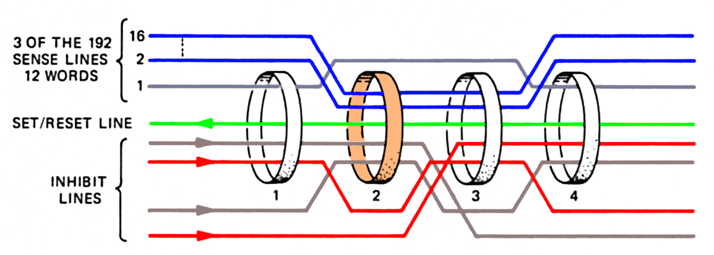

# Core Rope Simulator

This repository documents a core rope simulator for the Apollo Guidance Computer. This simulator was built by Raytheon around 1970 and plugged into the Apollo Guidance Computer in place of the 6 core rope modules. It allowed an external computer to provide the rope data.

The [Apollo Guidance Computer](https://en.wikipedia.org/wiki/Apollo_Guidance_Computer)  is the famous computer used to navigate to the Moon during the Apollo missions.
Its programs were stored in a 36K word ROM, constructed from [core rope memory](https://en.wikipedia.org/wiki/Core_rope_memory); data was stored by putting wires through or around magenetic cores to store 1's or 0's.

Each core rope needed to be constructed by hand  (with some mechanical help), a very slow process. Thus, for development and ground testing, a different mechanism was used: the core rope simulator.
The simulator allowed an external computer to simulate the core rope, allowing the AGC to run arbitrary programs.

The simulator consists of two boxes that plug into the AGC's core rope slots, providing an interface between the AGC's address and data lines and the external computer. Each box has a MIL Spec 20-39P receptacle for connection to the external computer (size 20, 39 pins). One box provides address information from the AGC, while the other box feeds 16 data bits into the AGC.

The [Portafam](http://www.klabs.org/history/ech/memos_misc/e-2402.pdf) is a different core rope simulator built by the MIT Instrumentation Laboratory in 1969. The Portafam has a totally different architecture internally.

## How core rope works

At a high level, core rope is simple: wires go through cores to indicate 1's, or bypass cores to indicate 0's, but the details get more complex.

The AGC uses 16 bit words (15 data bits and parity). The ropes hold 36K (36864) words.

The rope memory is organized as three ropes. Each rope consists of two separate modules, wired together by the AGC backplane into one unit electrically.
A module consists of 512 cores.
Each core has 12×16 data wires passing through (or around it), corresponding to 12 words stored per core. (Note the high density compared to regular (RAM) core memory, which holds 1 bit per core.)
Each group of 16 words is called a *strand*, so there are 12 strands per core.

To summarize, 6 modules × 512 cores per module × 12 strands per core = 36864 words.

## Properties of cores
Several properties of cores are important to this discussion.

 A core is magnetized into one of two states.
 Wires can be threaded through the core to change its state. When the opposite current is passed through a core, the core will flip to the opposite state. (If the current direction matches the core's state, the core does not flip but remains in the same state.)
 
When a core flips to the opposite state, this induces a current in a sense wire threaded through the core. If the core does not flip, no current is induced in the sense wire (except for noise current).

Cores have a hysteresis property. A low current will have no effect on a core. But a current above a threshold will flip the core to match the polarity of the current. 

The hysteresis property is important because it allows cores to be addressed using multiple wires. If there are multiple wires threaded through a core, the sum of the currents controls whether or not the core flips. An *inhibit* line with opposite current can cancel out the current from another line.

(Regular erasable core memory uses a "coincident-current" technique with an X/Y grid of select lines through the cores. An X line and a Y line are energized with half the necessary current. The core at the intersection of the X and Y lines has enough current to flip. Thus, a single core in the grid is selected through the X and Y lines.)

To access a word from the core rope, first the selected core is *set*, flipping it on.
The core rope uses seven address lines to select a particular core.
Each core has seven inhibit lines through it, corresponding to the address bits that should *not* be 1's.
Every core except the selected one will have at least one inhibit line 1, blocking the core from being set (flipped).

Somewhat unexpectedly, the value isn't read from core at this point, but during the reset phase, when the core is flipped back to its 0 state.
A reset signal is passed through all the cores. Only the core that was flipped during the set state will flip back during the reset state. This induces a current in all the sense wires (12 strands of 16 bits) that pass through that core. This allows the value of the core to be read out.

Finally, the 16 weak sense line signals are amplified by the sense amps and converted to the 16-bit digital output.

### Complications

There are several complications to this.

All 12 strands receive signals, but we want to read only one of the strands.
This is accomplished by the strand select signals: 12 signals that select the desired strand.
These signals block all the strands except the desired one (using a diode circuit, see [MIT's Role in Project Apollo, Vol. III](http://ibiblio.org/apollo/hrst/archive/1029.pdf) Fig 3-13), so only one strand passes its signal to the sense amp.

Similarly, six module select lines are used to select one of the six modules and short out the sense lines from the other five modules.

Note that 7 address lines select one of 128 cores. Each module consists of four planes of 128 cores, yielding 512 cores.
To select one of the four planes, four different reset lines are used, to reset just the core in the desired plane. Thus, only that plane is read.
Two set lines are used, one to set cores in planes A and B, and one for planes C and D. At set time, the reset
line blocks the undesired plane.
Thus, one core will be set.

Finally, in addition to the 7 address inhibit lines, there is an eighth address parity inhibit line.
The purpose of this is to ensure that every non-selected core gets two inhibit signals and is solidly inhibited. Otherwise, a core with just one inhibit line high might receive a bit of current, changing its magnetism slightly and introducing noise.

## Guide to documentation

Fixed memory is described in the AC Electronic LM Manual volume 2 starting at [4-594](https://archive.org/details/acelectroniclmma00acel_0/page/n275).

### Inhibit circuit

The inhibit circuit and return are described [here](https://archive.org/details/acelectroniclmma00acel_0/page/n279) and the schematic is [here](https://archive.org/details/acelectroniclmma00acel_0/page/n287).

### Strand and module select

The strand and module select circuits are described [here](https://archive.org/details/acelectroniclmma00acel_0/page/n296) and the schematics are [here](https://archive.org/details/acelectroniclmma00acel_0/page/n284) and [here](https://archive.org/details/acelectroniclmma00acel_0/page/n298).

### Sense amplifiers

The sense amplifiers are described [here](https://archive.org/details/acelectroniclmma00acel_0/page/n296) and the schematic is [here](https://archive.org/details/acelectroniclmma00acel_0/page/n298).

### Set and reset circuits

The set circuit and return are described [here](https://archive.org/details/acelectroniclmma00acel_0/page/n275) and [here](https://archive.org/details/acelectroniclmma00acel_0/page/n278) and the schematics are [here](https://archive.org/details/acelectroniclmma00acel_0/page/n282) and [here](https://archive.org/details/acelectroniclmma00acel_0/page/n291).

SET ENABLE is activated by ROP·T10·PHS4
and cleared by T01·PHS3 or TIMR (stop/alarm).
RESET ENABLE is activated by ROP·T05·PHS3
and cleared by T08 or GOJAM.
[schematic](https://archive.org/details/acelectroniclmma00acel_0/page/n277) 

The reset circuit and return are described [here](https://archive.org/details/acelectroniclmma00acel_0/page/n275) and [here](https://archive.org/details/acelectroniclmma00acel_0/page/n278) and the schematic is [here](https://archive.org/details/acelectroniclmma00acel_0/page/n289).

The documented description of the set and reset circuits is incomplete.
Since each set line passes through two planes, a mechanism is required to prevent the core in the wrong plane from being set.
This is accomplished by triggering the reset line in the other plane at the same time as the set line.
This is implemented by CLEARA/CLEARB/CLEARC/CLEARD (unrelated to the clear line), shown on schematic [4-208](https://archive.org/details/acelectroniclmma00acel_0/page/n281).
Thus, there are two different reset lines triggered at different times during a fixed memory access.

### Clear circuit

A *clear* line passes through all the cores; it can be used to reset all the cores.
The clear line is used only for an "aborted" fixed memory access. For a quarter code instruction, a fixed memory cycle can start before it is determined that erasable memory is being accessed. In this case, the clear line resets the fixed core that was set. ([Summary](https://archive.org/details/acelectroniclmma00acel_0/page/n275) and [details](https://www.ibiblio.org/apollo/Documents/dd_memo_376.pdf).) The schematic is [here](https://archive.org/details/acelectroniclmma00acel_0/page/n293).

For example, the instruction `INCR K` has opcode `26000+K`. Since bit S12 is set, it looks like a fixed memory operation and the fixed memory cycle will start. However, it is a [quartercode](https://www.ibiblio.org/apollo/assembly_language_manual.html#Instruction_Representation) instruction on erasable memory.
When the instruction is decoded, the clear line is used to clean up the partial fixed memory access.

CLROPE is generated by ROP'·T02 (if a fixed read cycle started with ROP·T10) and cleared by T03 (along with some other conditions), see [figure 4-206](https://archive.org/details/acelectroniclmma00acel_0/page/n277)

## Summary

Putting this all together, the module select lines select one of 6 modules. The reset lines select one of four planes in the module. The 7 address lines select one of 128 cores in the plane. The strand select lines select one of 12 strands of 16 bit wires through the core. This yields 6 × 4 × 128 × 12 = 36864 words in total.

## Addressing

Instructions have a 12-bit address field, allowing 4K words to be directly addressed. The full address space is accessed through a complex bank system. The bank system is not particularly relevant to the simulator; instead, the internal addressing is what's important.

In the following description, the memory bank registers have been decoded ([discussion](https://archive.org/details/acelectroniclmma00acel_0/page/n95), [logic](https://archive.org/details/acelectroniclmma00acel_0/page/n101)) to generate a 16-bit fixed (i.e. rope) address.
The 36K of rope storage is mapped into this address space linearly, without holes, starting at address 0.

The address consists of signals S1 (low bit) through S10 and F11 through F16 (high bit). Bits S1 through S10 are the low nine bits from the "normal" address (in the S register) and bits F11-F16 are fixed address bits generated from the fixed register.
See discussion starting at [page 4-571](https://archive.org/details/acelectroniclmma00acel_0/page/n252) of *AC Electronic LM Manual Volume 2*.

The low order bits S1 through S7 of the address select one of the 128 cores in a rope module. Bits S8 and S9 select one of the four planes in a module. Thus, the bottom 9 bits select one of 512 words in a straighforward way.

The tricky part of addressing is the 12 strands and 6 modules don't map cleanly onto binary bits. Considerable logic is required in the AGC to convert a binary address into strands and modules without holes in the address space, and the rope simulator reverses this logic.

S10 and F11 through F16 are used to generate the 12 strand signals (slightly encoded), 2 module group select signals, and three rope select signals. The 6 bits generate 72 output patterns in sequence, each selecting a 512-word block of memory.

The strand addressing sequence starts with strand 1, low module, rope R. It proceeds through the 12 strands in sequence in the low module, and then the high module, for address bits 000000 through 0010111. The next 24 address blocks go through the same sequence in rope S. Finally, the sequence is repeated in rope T.

The AGC's rope, module, and strand selector gates are shown on [figure 4-209](https://archive.org/details/acelectroniclmma00acel_0/page/n284) of *AC Electronic LM Manual Volume 2*. This circuit uses over 50 NOR gates on module A15.

The simulator reverses this entire process. It detects the inhibit, set, reset, module select, and rope select signals, and generates a linear 16-bit address from them.

## Timing

A memory cycle consists of twelve cycles of 0.977 microseconds, 11.7 microseconds in total.
The fixed memory timing diagram is [figure 4-197](https://archive.org/details/acelectroniclmma00acel_0/page/n257), schematic [figure 4-206](https://archive.org/details/acelectroniclmma00acel_0/page/n277) and discussion at [page 4-595](https://archive.org/details/acelectroniclmma00acel_0/page/n276).

Inhibit lines are enabled starting at time T08 until T01.
The set line is enabled from T10 to T01.Strand lines are enabled from T02 to T08 via STRGAT.The reset line is triggered from T05 to T08.

The sense amp reads the data from T06 to T07.

The signals happen at particular phases during the T cycles, using PHS3.

IHENV set by T08
STRGAT set by ROP and T02, cleared by T08.

## The simulator

The rope simulator consists of two boxes.
Each box takes up three module slots.
One box sends address signals from the AGC to the external computer, while the other box sends a data word from the external computer to the AGC.
The first box (which I'll call the address box) is mounted in AGC slots B1/B3/B5.
The second box (which I'll call the data box) is mounted in AGC slots B2/B4/B6.
The address box is considerably more complex than the data box.

Each box has a round connector (MIL Spec 20-39P with unusual keying) for communication with the external computer.
The address box sends signals to the external computer using a a7820 differential line driver, while the data box receives signals from the external computer using a 7830 differential line receiver.
Power is supplied to both boxes through the address box connector.

The AGC's core rope circuitry produces several complications for the simulator. 
First, the AGC doesn't provide a convenient memory bus;
there aren't address and data lines with power and ground.
Instead, the signals on the rope connectors are current pulses designed to drive the cores directly.
Second, each pair of rope modules is electrically wired together (by the AGC backplane) to form one rope unit, and each signal forms a loop through both modules.
Thus, both simulator boxes must work together to complete the circuit for each signal.
Finally, the AGC provides a separate signal return path for each rope. Thus, the simulator can't simply feed signals to ground, but must use a diode matrix on each signal to handle the multiple return paths.

## Construction

The simulator consists of two metal boxes that slide into the AGC.
Each box has a round 39-pin connector for communication with the external computer.

The simulator is constructed with techniques that may seem unusual today.
The construction is a combination of wirewrapped TTL chips and cordwood analog circuitry (mostly pulse transformers).

The logic circuitry is built from 5400-series TTL chips.

### Dipstik

The chips are mounted using a product called *Dipstik*, which was briefly popular in the early 1970s.
Each Dipstik unit holds five DIP chips. The Dipstik has wirewrap pins underneath for the circuit wiring.
In addition, the Dipstik has solder lugs on top, which are used to connect resistors and capacitors.

The Dipstik consists of two parts: a top and bottom. Each part has two rows of gold contacts.
Five ICs are placed on the top, and held in place by a retaining bar. The inside of each IC pin is held against a gold contact on the top piece.
The top is placed upside down on the bottom part and screwed into place.
Gold contacts on the bottom press against the outside of each IC pin.
Thus, each IC pin is sandwiched between two gold contacts.

The Dipstik provides a structured way of organizing the ICs.
Each Dipstik holds 5 ICs, labeled A through E.
There are 18 pin positions for each IC, so 14-pin ICs have two unused pairs between ICs, while 16-pin ICs have one unused pair.
The pins are labeled on both sides of the Dipstik for convenience; a number like 8-10 indicates pin 8 for a 16-pin IC and pin 10 for a 14-pin IC.

Each Dipstik is labeled sequentially: DS1, DS2, etc.
Thus, a particular IC pin can be specified by the Dipstik number, IC letter, and pin number, such as DS1-E-3 for pin 3 of IC E in Dipstik 1.

Unfortunately Dipstiks have several problem (which probably led to the short life of the product).
First, the tabs holding the retaining bar on the top part break. The retaining bar remains stuck at the bottom of the Dipstik and half of the ICs stay upside down in the Dipstik when the top is remove.
This isn't a huge problem, as long as the metal fragments are removed so they don't cause shorts.
Second, the ICs don't make good contact with the top. (This can be seen by testing connectivity of the power or ground pins on the top.) The solution is to bend the pins of each IC inward slightly so they grip the top more firmly.
Third, we received reports that the screw-down mechanism doesn't provide as much pressure in the middle, causing worse connections in the middle ICs.

### Connector

Each of the six AGC module slots has a connector for the rope module.
The connector has four rows of 24 female Malco mini-wasp contacts.
To match this, each rope simulator box has three sets of 4x24 male Malco pins.

## Simulator timing
The set line is enabled from T10 to T01. This triggers a signal to the external computer from T11 to T07.
 A one-shot is triggered 550 ns after STRGAT, and when STRGAT drops, the flip flop reset signal is generated.
 The clear signal is enabled at ???; it is gated by a one-shot triggered off STRGAT for T03.

## References

* [AC Electronic LM Manual Volume 2](https://archive.org/details/acelectroniclmma00acel_0/page/n245) has lots of information on the AGC's fixed memory, including schematics.

* [MIT's Role in Project Apollo, Vol. III: Computer Subsystem](https://www.ibiblio.org/apollo/hrst/archive/1029.pdf). Fixed memory is discussed in Section 3.5.2. Core rope simulators are discussed briefly in Section 5.3.1.

[Core rope wiring diagram](https://archive.org/stream/agc_handbook_jp2#page/n112/mode/2up)

